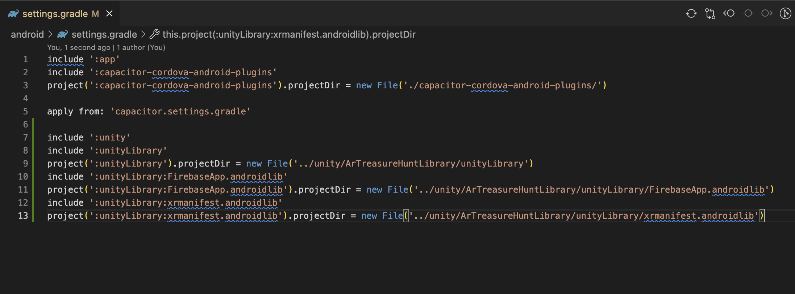
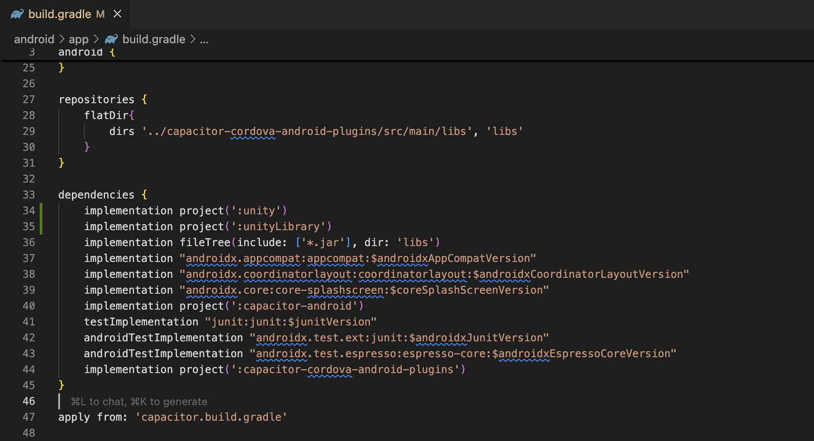
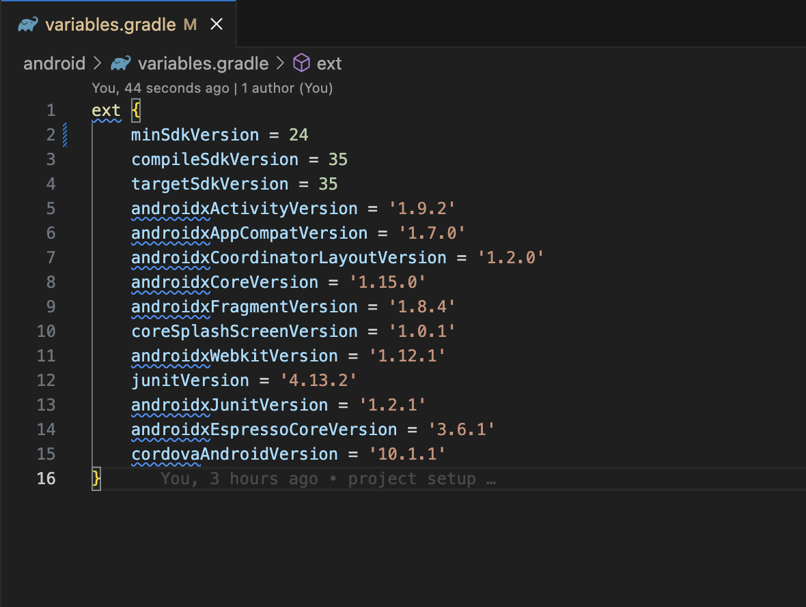

# Ionic + Unity Integration Guide

### 1. Create Ionic Angular Application
```bash
ionic start
```

### 2. Add Android Platform in Ionic Application
```bash
npm install @capacitor/android
npx cap add android
```

### 3. Add Unity Project
Place the Unity project inside a folder named `unity`.

### 4. Install the custom Unity plugin
```bash
npm i https://github.com/freelancework00700/unity-plugin.git
```

---

### 5. Sync android project
```bash
npx cap sync android
```

---

### 6. Add below lines in android/settings.gradle
```gradle
include ':unity'
include ':unityLibrary'
project(':unityLibrary').projectDir = new File('../unity/ArTreasureHuntLibrary/unityLibrary')
include ':unityLibrary:FirebaseApp.androidlib'
project(':unityLibrary:FirebaseApp.androidlib').projectDir = new File('../unity/ArTreasureHuntLibrary/unityLibrary/FirebaseApp.androidlib')
include ':unityLibrary:xrmanifest.androidlib'
project(':unityLibrary:xrmanifest.androidlib').projectDir = new File('../unity/ArTreasureHuntLibrary/unityLibrary/xrmanifest.androidlib')
```



### 7. Add below lines in android/app/build.gradle
```gradle
implementation project(':unity')
implementation project(':unityLibrary')
```



---

### 8. Update android/variables.gradle (set minSdkVersion to 24)
```gradle
ext {
    minSdkVersion = 24
    ...others
}
```



---

### 9. Quick fix (run after Unity export or when libs change)
```bash
mkdir -p android/app/libs
```
```bash
cp unity/ArTreasureHuntLibrary/unityLibrary/libs/*.aar android/app/libs/
```
